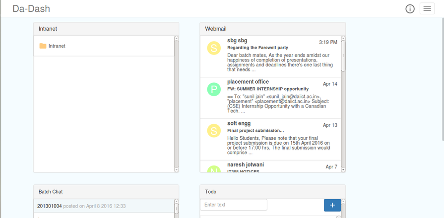
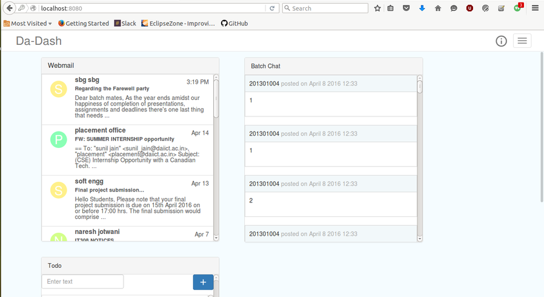
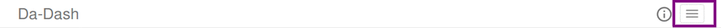

# Dashboard

---

Dashboard is the home page of DA-Dash. It provides its users with a wide variety of options, features and functionalities. 

#### After First Login
For the first time user logins, he is provided with all the widgets- Intranet, Webmail, ToDo, Class Notes and Chatroom. He can access all the widgets. He can then go to widget catalog for managing, removing and adding widgets.
 
 

#### Further Logins
For the second and onward logins, users' previous session will be resumed and user will see his previously selected widgets on the dashboard. He can then add more widgets from the widget catalog. 
Suppose user does not want to have Intranet widget. After changing widget preference from the widget catalog, user will see all the widgets except Intranet Widget.
 
 

#### Hamburger
There is a hamburger present on the top-right corner. On clicking this button, user can see the sidebar with various options.

####Widgets
After choosing the widgets from the widget catalog or on the first login, user can see selected widgets on the homepage of the dashboard. User can then click on these widgets for accessing and switching to full screen view for some.
