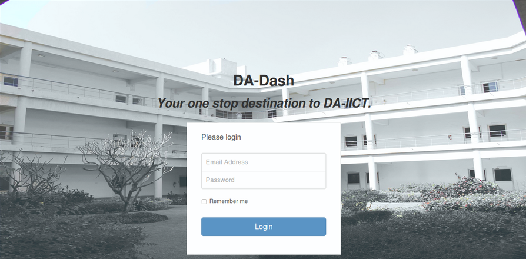

# Login

---

Any user with valid Webmail ID and password can login. It is necessary for the user to be a student of DA-IICT and has a valid working Webmail ID-password. 
 
 

For accessing DA-Dash, user has to provide valid login credentials on the Login page.
  (screenshot) 
 User can request for `Remember me` to avoid verifying credentials each time a login has to be done.
 