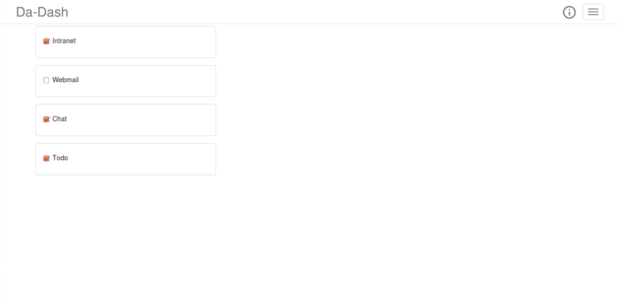

# Choose Widgets

The application is designed in a manner to provide user with a variety of widgets. As different users have different user requirements, DA-Dash provides its users with a widget catalog. This will help users to choose widgets of their choice without clustering a lot on personalized dashboard. Also, as user demands keep on changing from time-to-time, a new list of widgets could be added to the widget catalog at some later point of time. 
In this page , user can mark required widgets and DA-Dash will provide the user with those widgets on their dashboard.  
This page provides user with two functionalities.
 
 

### Choosing new Widgets
The widgets with their checkbox marked are the already selected widgets. User can select new widget from the list and the widget will appear on the dashboard.
### Re-arranging the widgets visibility on the Dashboard
User can maintain the most used widgets on the top.
Hold the mouse and drop the widget to its new position in the list, changes will get reflected on the dashboard.
### Removing Widget from the Dashboard
From the list, `demark the checkbox` of the widget user wants to remove from the dashboard.