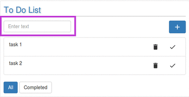
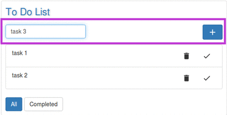
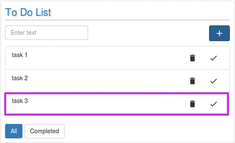

# Adding a task to the List

---

User can add any number of tasks in the list.  

* Enter the task in the textbox.  

* Click on the `Plus` button placed on the right-top corner.   

* This will add task to the list.
  
  

