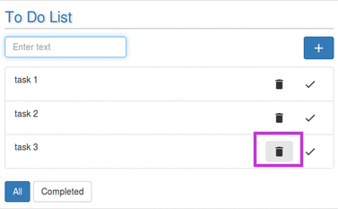

# Deleting a task from the List
Once the user has completed a task, task can be deleted from the list as follows: 
* Click the delete button corresponding to the task whose deletion is needed.  

  The above step will delete "task 3" from the list in the figure.
