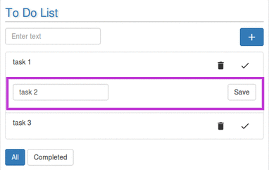
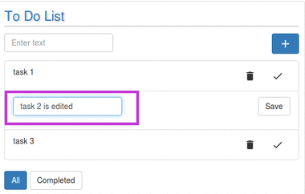
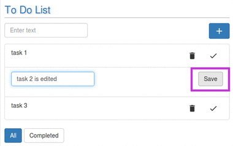

# Editing task in the List

Todo widget provides its users with a feature of editing an already defined task in the list.
 
 
Follow the following simple steps to edit the task/task description.
* Double click the task you want to edit.
For example, suppose in the list , we want to edit task 2.On double clicking , one will see the following:  

* Make required changes in the task.
 
 

* Click on Save button. Your new task is ready.
  
 

