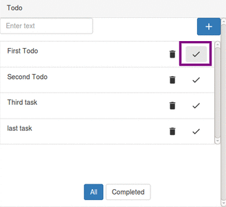
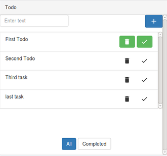

# Marking a task as Completed

---

Once a task is complete, it can be marked as `Completed`. This will help the user in differentiating "completed" tasks from "incomplete" tasks.  
 
* User can mark a task complete by clicking on the `Tick` button of the corresponding task. 
  

 
* The task marked will appear green.

* By `Re-clicking the Tick` button , task can be again marked as in-complete.
