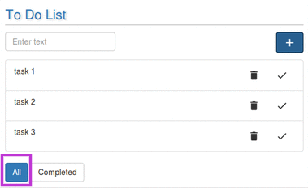
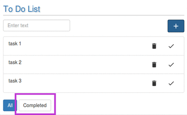

# Viewing Options

---

User is provided with two viewing options-
1. Viewing the complete list of all tasks,
2. Viewing the list of only completed tasks. 
 

---

For viewing the complete list , click on the "All" button.
 
 
 
 

---

For viewing the list of all completed tasks, click on "Completed button".
 

  