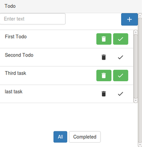
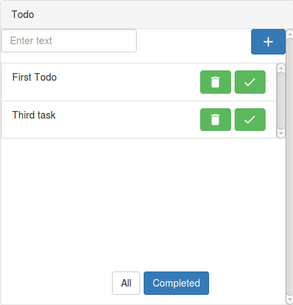

# Viewing Options

---

User has two viewing options.

###Viewing the List of all Tasks
It will consist of both completed and incompleted task.
For viewing the complete list , click on the `All` button.
 
 
 
  

###Viewing the List of Completed Tasks

For viewing the list of all completed tasks, click on the `Completed` button.
 

  
  