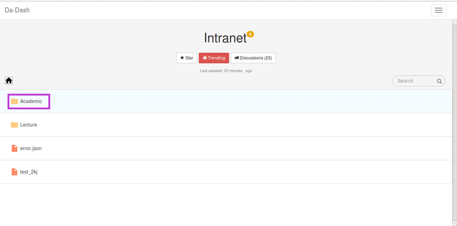

# Academic
  Academic folder allows access to all announcements and information related to :
  * Academic Calendar
  * Academic Requirements 
  * Activity Calendar
  * Curriculum (B-Tech/M-Tech/M-Sc/M-Des/Phd)
  * Courses
  * Disciplinary guidelines for students
  * Vehicle rules
  * Code of Conduct for students
  * Exam Time Table
  * Holidays
  * MoUs
  * Medical Facilities
  * Registration and Scholarships at Da-iict
  * Time Table for each semester

##Accessing Academic Folder:

For accessing academic folder, go to Intranet< Academic. This will open the Academic folder which consists of all the above mentioned folders including others.

### Accessing folders in Academic
Suppose you want to open any folder or file in Academic folder, go to Intranet  < Academic < "folder_name".

