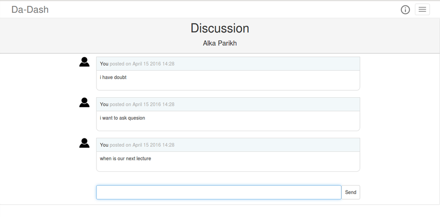

# Discussions

---

Discussions page helps user in holding discussions for folders and courses. It provides user with an option of discussing anything and everything for the opened folder. Students can post any course/folder related queries and doubts. Any other user can reply to those queries.
 
 
For holding discussions, go to the folder in which user wants to hold discussion and click on the `Discussions` button. Write any message and it will be visible to others.

