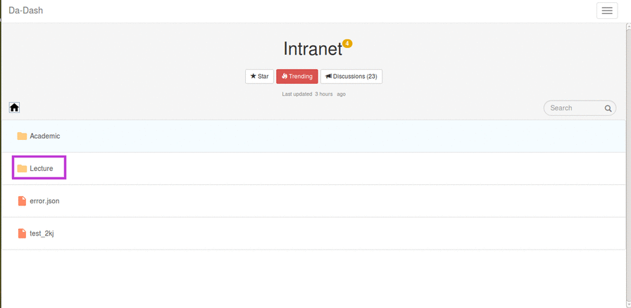

# Lecture

The Lecture folder provides lectures and other course related information of all the professors of Da-iict. It is designed in the form of hierarchy where user can select the professor, then the course , then the lecture slides/labs according to the requirement.

###Accessing Lecture Folder

On the full screen view of Intranet, user can directly click on Lecture to access the folder.

