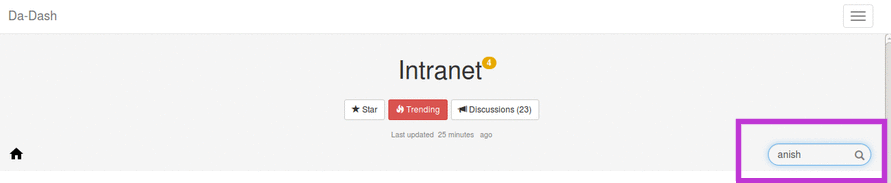
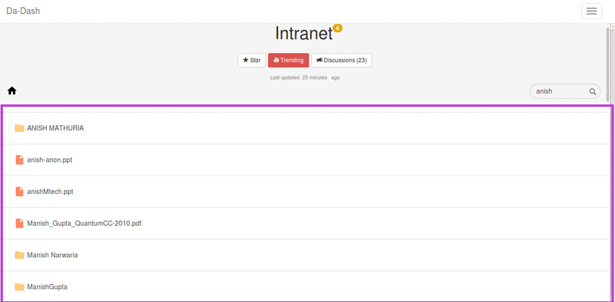
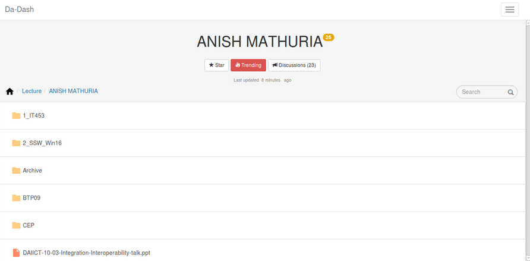

# Search

---

User can search anything in the intranet widget by using the Search.

The scope of this search is of Intranet widget,i.e., the results of any search request will be Intranet-specific.  
### Quick Search
Quick Search provides quick results to user's search request. The results include major folders starting or containing the requested word. These search results appear on the top of the results list. The result  
### Long Search
The results of the Long search get appended to the results of the Quick Search. These results appear after few minutes of the request.  
For example, user wants to search for Professor Anish Mathuria which is in the Lecture Folder.
*  Write "anish" in the Search bar.
    
* All the results relevant to the word "anish" will be displayed.
* Click on the "Anish Mathuria " folder to see the folders of Anish Mathuria.
 
