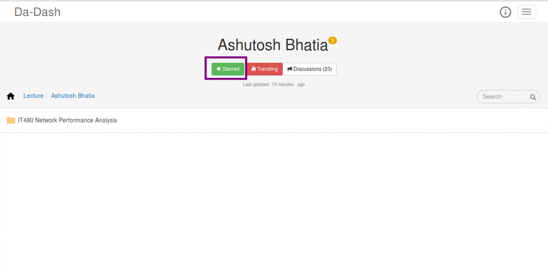
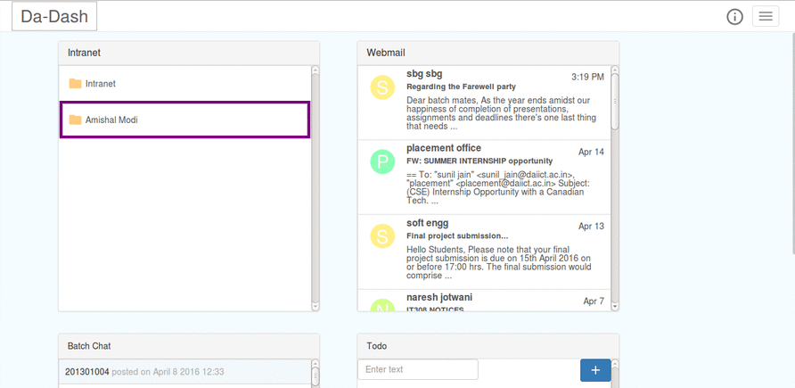

# Star

---

Intranet widget provides its users a feature to mark certain folders and files as favorites. This feature is embedded  through `Star` button.  
###Marking Folders Favorite
On clicking the `Star` button in the folder that needs to be marked favorite , user can mark the folder favorite.  
 

###Viewing and Accessing Favorite Folders.
The favorite marked folders are visible on the Intranet widget on the Dashboard. User can click on the folder there to direclty open that folder in the full screen view of the Intranet widget.
  

