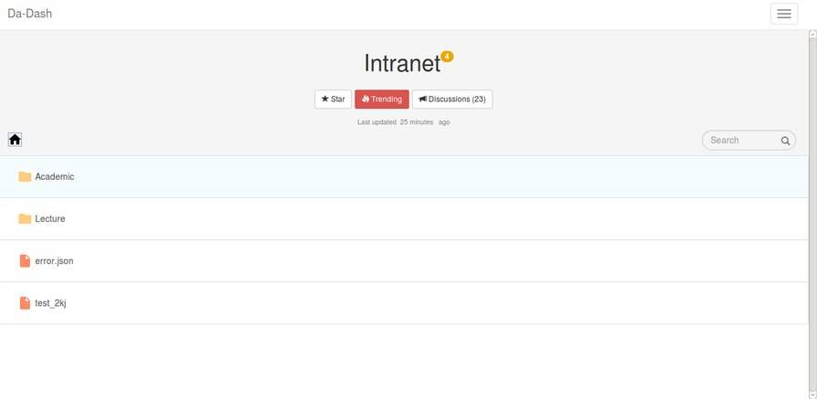

# Intranet

Intranet widget provides user with full access to DA-IICT’s intranet. Users can select the folders that they want to see in the widget. Widget will then show these filtered folders. User can select the folder from the list provided on intranet. User can click on the folder to view the material inside. As all the folders and files are directly linked to intranet, user will have the same files as in the Intranet.

### Intranet (full screen view)
