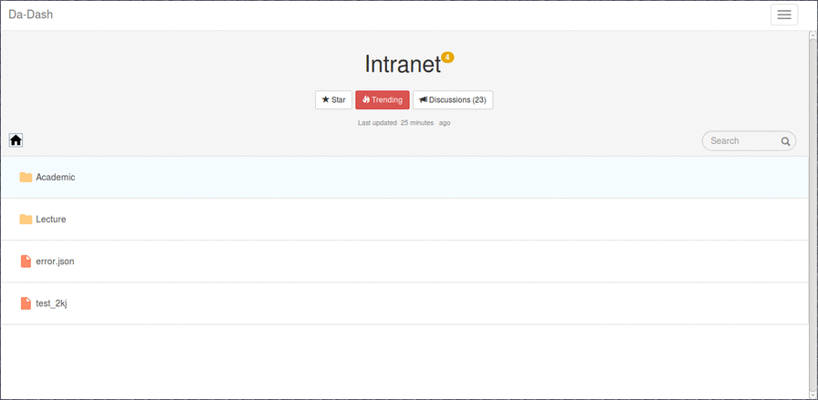
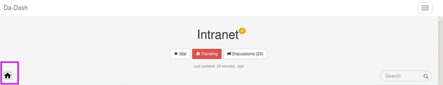

# Intranet

Intranet widget provides user with full access to DA-IICT’s intranet. Users can select the folders that they want to see in the widget. Widget will then show these filtered folders. User can select the folder from the list provided on intranet. User can click on the folder to view the material inside. As all the folders and files are directly linked to intranet, user will have the same files as in the Intranet.

###Accessing Intranet Widget
 Click on the Intranet widget to get the full screen view for accessing it.

### Intranet (Full Screen View)  

 
User has following features :
* Home Button
* [Star](intranet/star.md) to mark files or folders as favorites.
* [Trending](intranet/star.md) to see what are the most trending files and folders. 
* [Discussions](intranet/Discussions.md) to be a part of any discussion related to any file or folder in the Lecture or Academic folder.
* [Search](intranet/Search) to search anywhere in the intranet widget.
* [Academic](intranet/Academic) and [Lecture](intranet/Lecture) folders to access all the folders of Da-iict's intranet.

###Navigating Files and Folders

#### Home Button
User can click on Home Button to return to the main page of Intranet full screen view.

#### Level System
On clicking any of the folders/files , the path of the selected file/folder will be displayed on the top.  The path displayed is a Level system of the form a/b/c meaning currently opened file is c which is placed in folder b with b placed in folder a. 

For example, accessing IT-215 folder of Anish Mathuria in the Lecture folder of Intranet- Home< Lecture< Anish Mathuria< IT-215:

##### Returning back to previous folders
If the user is accessing folder/file c on the path a/b/c , he can return to folder/file a by simply clicking on a in the path.

For example, to return to lecture folder while accesing folder IT-215 of Anish Mathuria. You can directly click on Lecture in the path.
