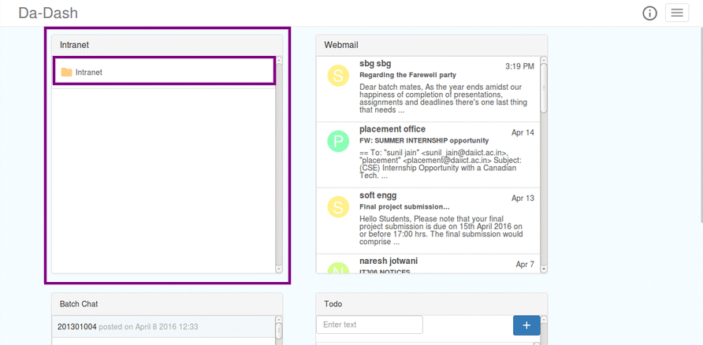
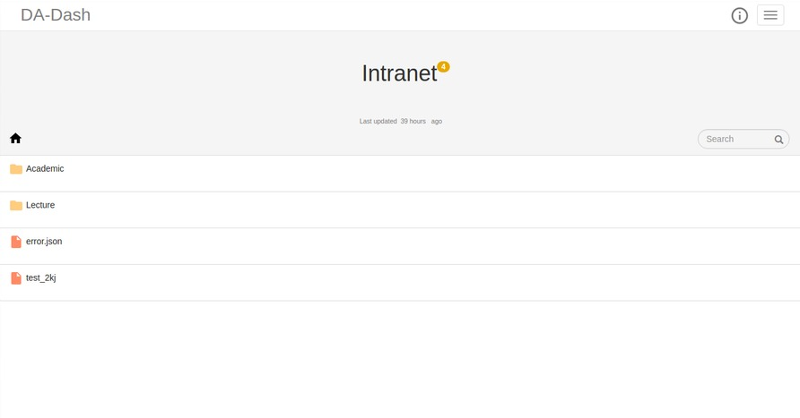
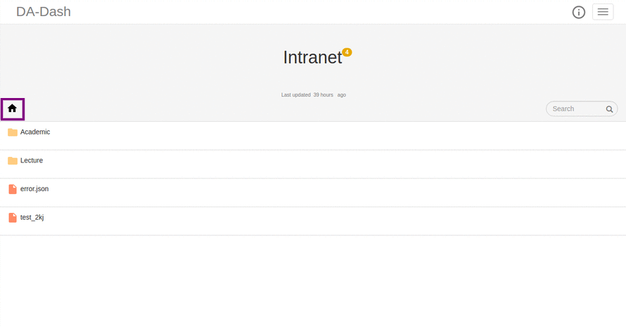
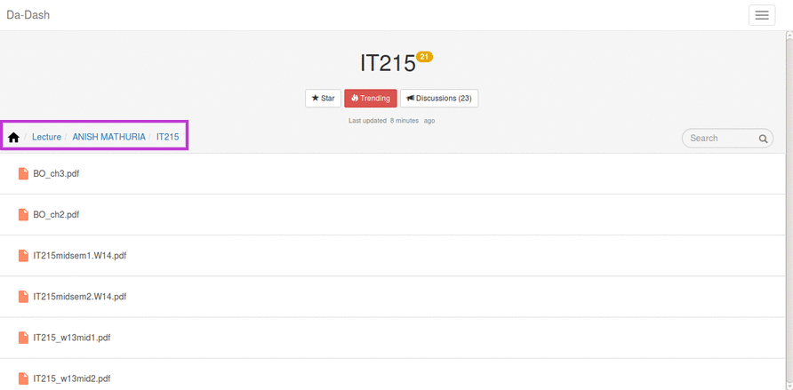
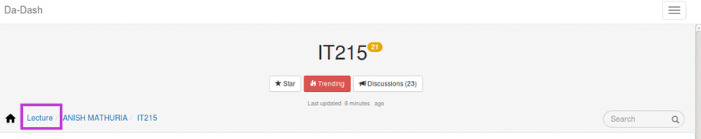

# Intranet

---

Intranet widget provides its users with full access to DA-IICT’s Intranet. Users can access different folders and files available on the Intranet of DA-IICT. Also, all the folders and files are direclty linked to intranet, so users will have the same files/folders as in the Intranet. It provides the feature of starring the favorite and most used folders. These folders then can be accessed directly from the Intranet widget.

###Accessing Intranet Widget
 Click on the `Intranet` widget to get the full screen view for accessing it.
   
 

### Intranet (Full Screen View)  

 
 **Home Button** 
 **Star** to mark files/folders favorite. 
 **Discussions** to be a part of any discussion related to files/folders in the Lecture and Academic folder. 
 **Search** to search anywhere in the intranet widget. 
 **Academic** and **Lecture** folders to access all the folders of DA-IICT's Intranet. 

###Navigating Files and Folders

#### Home Button
User can click on Home Button to return to the main page of Intranet full screen view.

#### Level System
On clicking any of the folders/files , the path of the selected file/folder are displayed on the top.  The path displayed is a Level system of the form a/b/c meaning currently opened file is c which is placed in folder b with b placed in folder a. 

For example, accessing IT-215 folder of Anish Mathuria in the Lecture folder of Intranet- `Home< Lecture< Anish Mathuria< IT-215`:

##### Returning back to previous folders
If the user is accessing folder/file c on the path a/b/c , he can return to folder/file a by simply clicking on a in the path.

For example, to return to lecture folder while accessing folder IT-215 of Anish Mathuria. You can directly click on `Lecture` in the path.
