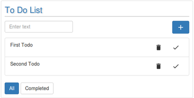
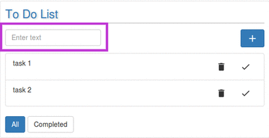
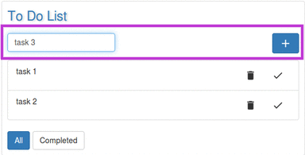
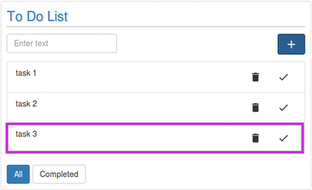

# ToDo

ToDo widget helps a user in maintaining a to-do list for them. A user can add, delete a task. Also, user can edit already saved tasks, on completion can mark a task completed or delete it from the list. It is a handy widget for helping users to maintain their list of work while doing other work simultaneously.

### Using ToDo widget.

The widget will appear on the dashboard. This widget has no full screen view. User can add/delete/edit on the widget itself. 

### Adding Task to the List
User can add any number of tasks in the list.  
For adding a task in the list , follow the steps as follows: 
1.Enter the task in the textbox.  

2.Click on the plus button placed on the right-top corner.   

This will add task to the list.
 

### Deleting Task from the List
### Editing a Task in the List
### Marking a task complete
### Viewing all tasks in the List
### Viewing all Completed tasks
