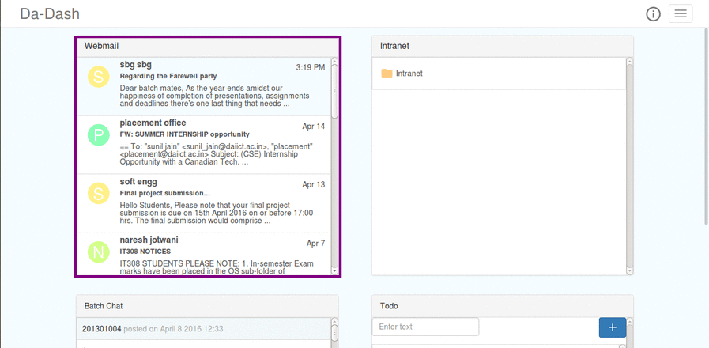
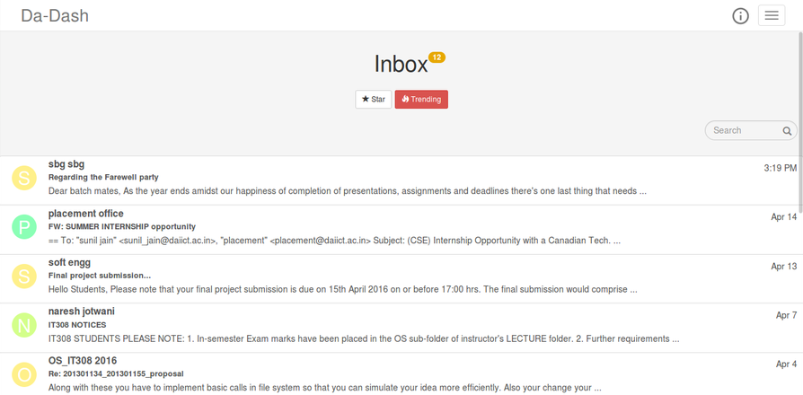

# Webmail

---

Webmail widget provides users with an access to their Zimbra Webmail. The users are provided easy-to-use features for accessing the mails. Some of these features include viewing the mails and searching the mails from a particular sender.

### Accessing the Webmail Widget
Click on the Webmail widget to open the full screen view and to access it.  

### Webmail (Full Screen View)

